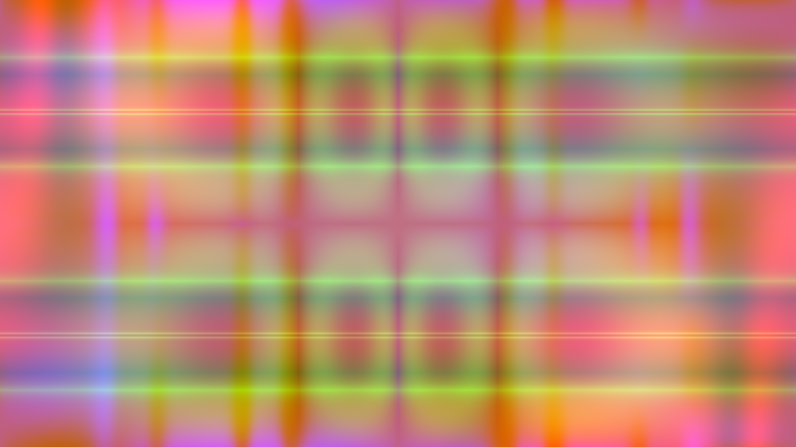

# Computational Art
## Introduction
This repository contains the code and two example output files of an assignment I completed for my Software Design class at Olin College in the fall of 2018.

The most important topics of the assignment were recursion and pseudo-randomness. Additional things I learned along the way were exporting image files, colormapping, etc.

## Explanation
The program creates images using embedded trigonometric functions. The user can select the number of recursions happening to create the function for Red, Green and Blue separately. 

# Output Examples

